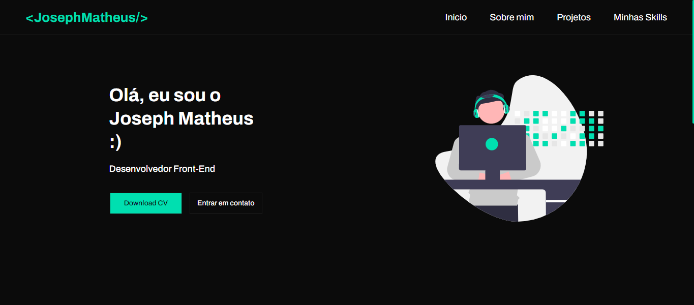

<h1 align="center">
  💻 Portfólio - Joseph Matheus
</h1>

<h4 align="center"><a href="https://josephmatheus.vercel.app/">Clique para visitar o projeto</a></h4>

## 📚 Seções

O site é composto por seis seções:

- **Início:** Nele temos uma breve apresentação com links para contato e download de currículo;
- **Sobre mim:** Nessa seção tenho uma descrição dizendo um pouco sobre quem sou;
- **Projetos:** Apresenta alguns projetos desenvolvidos e com link direto para os respectivos códigos no GitHub;
- **Minhas Skills:** Nele apresento meus conhecimentos em algumas linguagens com foco no front-end;

---

## 💼 Tecnologias utilizadas

Para o desenvolvimento deste site utilizei as seguintes tecnologias:

- HTML;
- Styled Components;
- React;
- TypeScript;

---

<h2>👨🏻‍💻 Autor</h2>

<table>
  <tr>
    <td align="center">
      <a href="https://github.com/josephmatheus">
         
        
          <b>Joseph Matheus</b>
        
      </a>
    </td>
  </tr>
</table>
